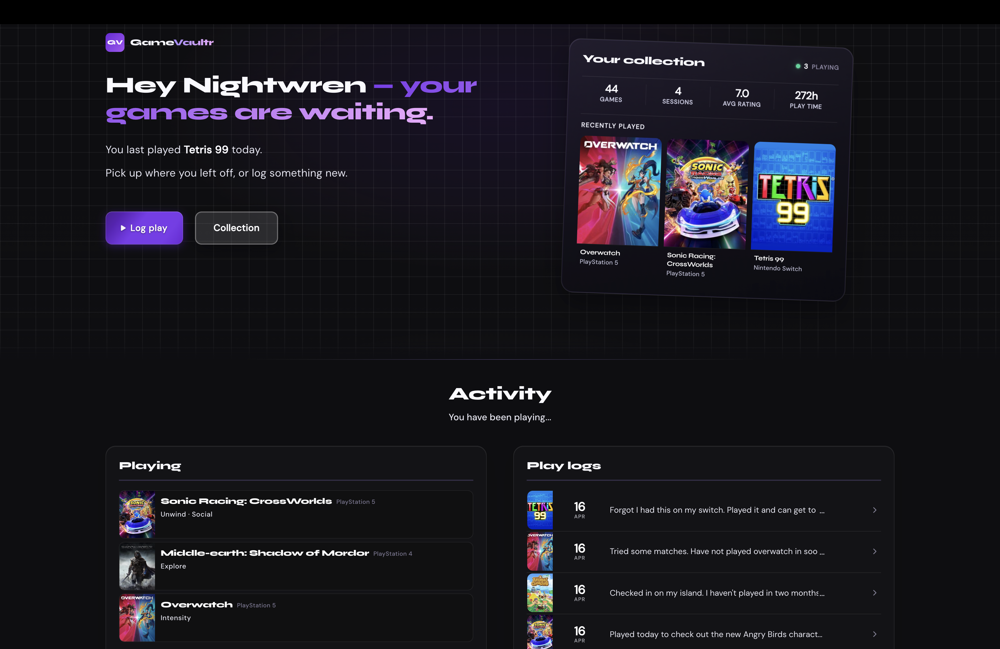
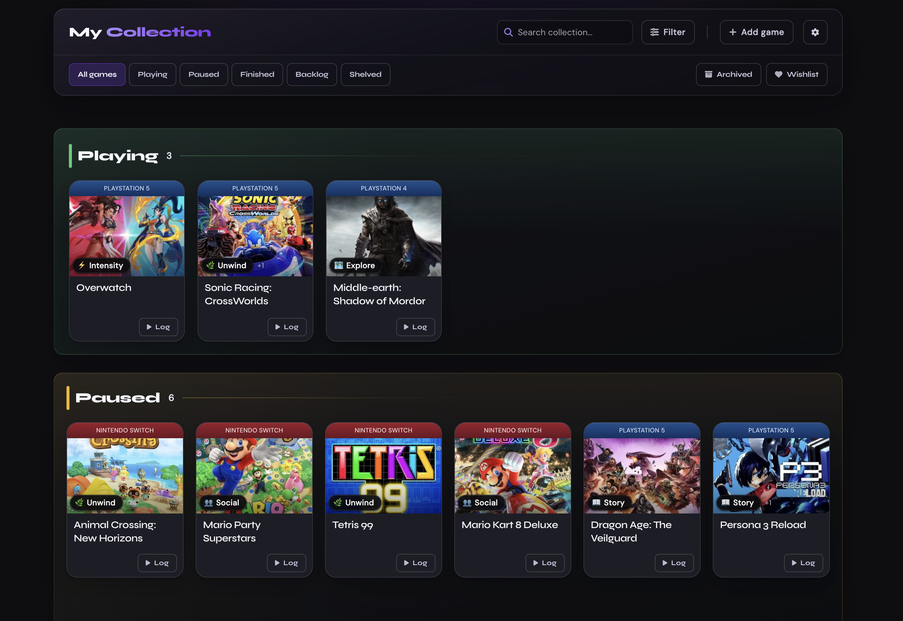
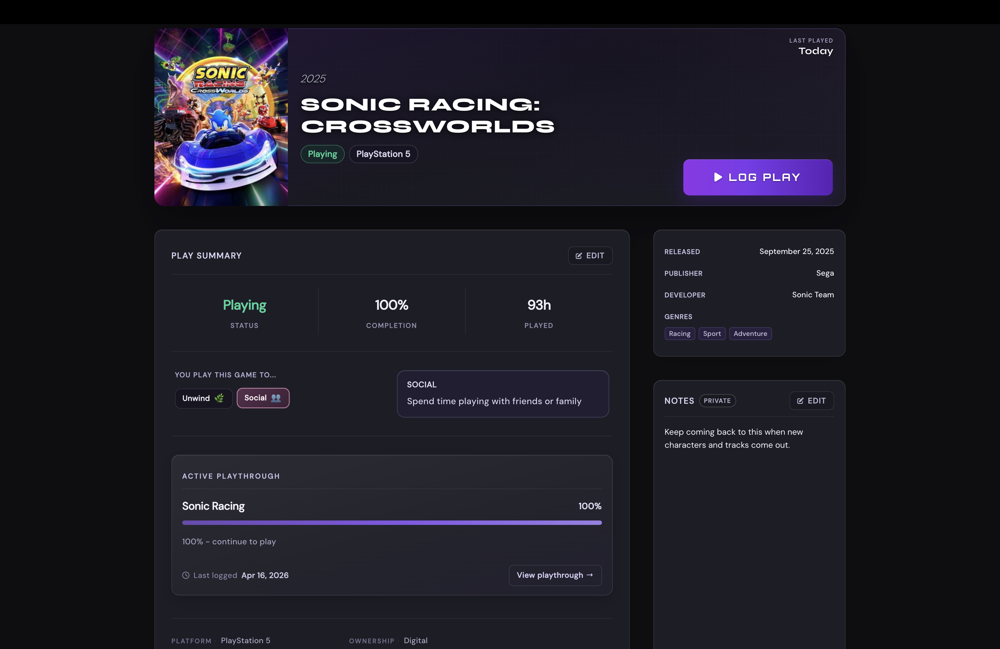
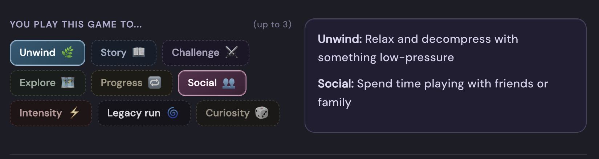
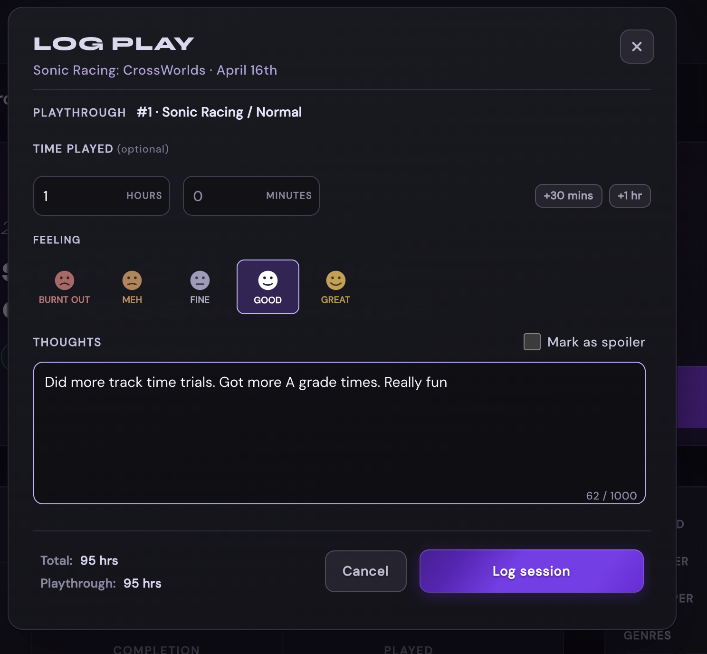
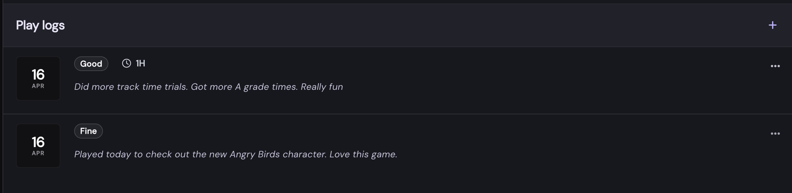
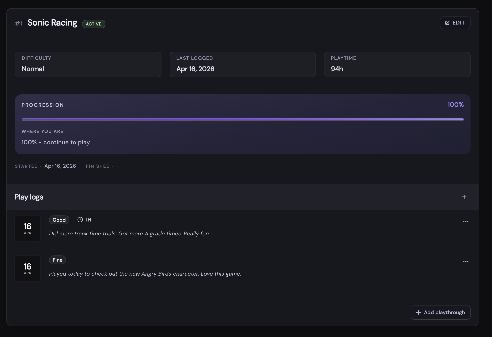
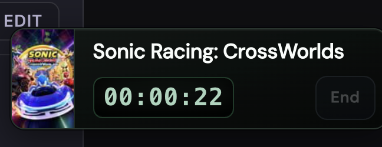
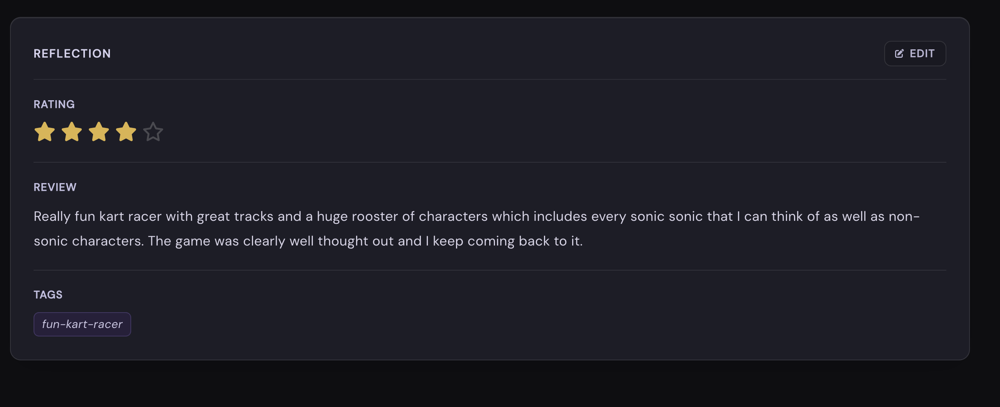

# Gamevaultr


**Gamevaultr** is a personal game vault: build your collection, then track playthroughs, sessions, ratings, and notes in one place.

## Live app

The site is fully usable at **[gamevaultr.com](https://gamevaultr.com)**.

Demo login:

```
Username: demo
Password: demopassword
```

## What you can do

- Search IGDB and add games to your collection
- Track ownership, play status, and per-game progress
- Manage playthrough history and your current run
- Log play sessions with notes and reflections
- Record ratings, reviews, and personal notes
- Measure playtime with a built-in session timer

---

## Product preview

### Home — your collection at a glance





### Search and add — build your library quickly


### Collection — organize and manage your games


### Game page — pick up where you left off



### Intentions — define how you want to play



### Session logging — record each play session







### Session timer — track playtime in real time



### Review and reflect — capture your experience



---

## Tech stack

| Layer | Technology |
| --- | --- |
| Backend | Spring Boot 4 (MVC) |
| Language | Java 21 |
| Build | Maven (`mvn` / `./mvnw`) |
| Data | Spring Data JPA + Hibernate |
| Database | PostgreSQL (default), H2 (local profile) |
| Security | Spring Security |
| UI | Thymeleaf + static assets |
| External API | IGDB (Twitch credentials) |
| Caching | Caffeine (service-level cache) |
